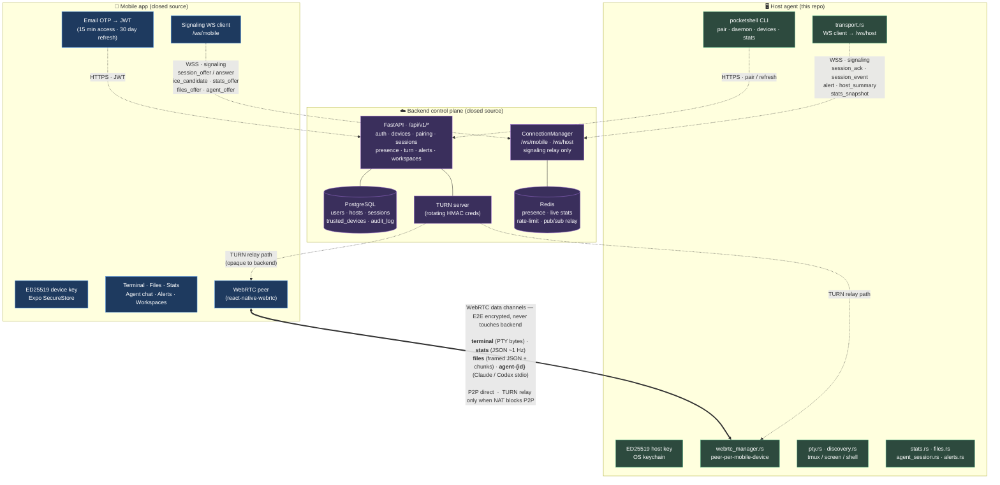
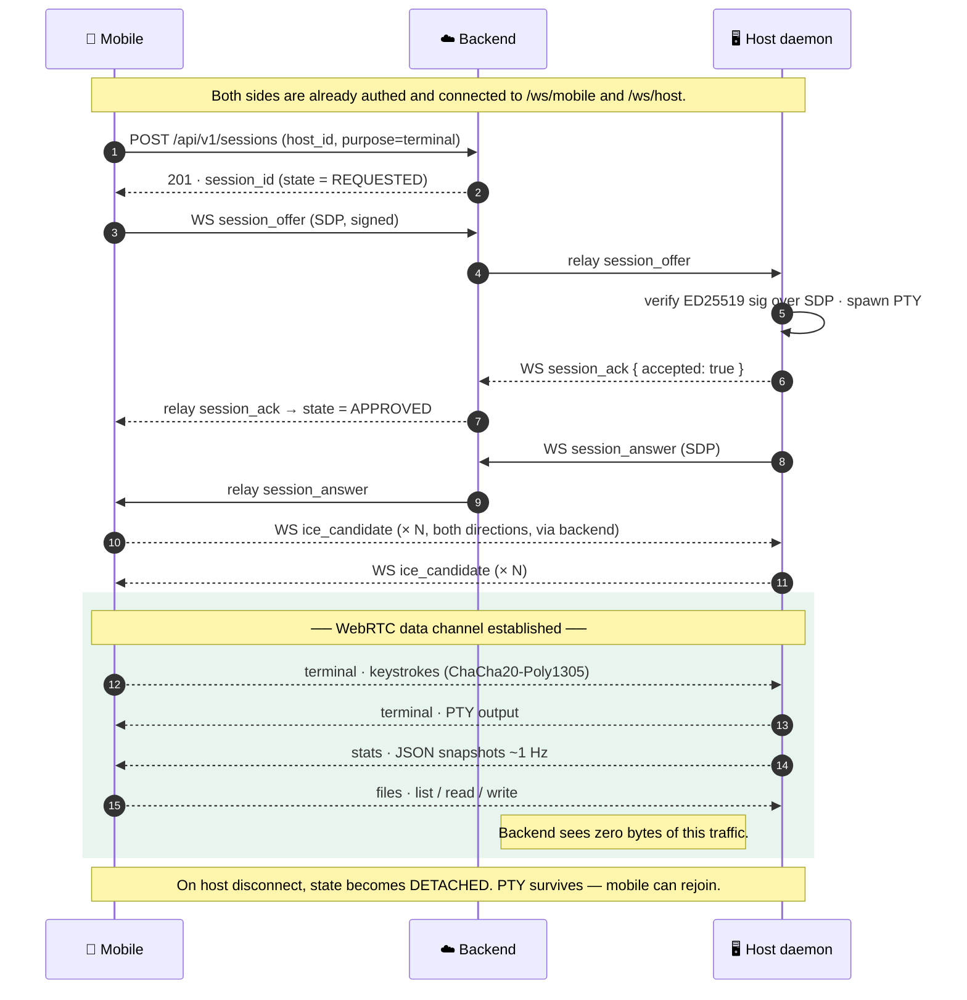

# PocketShell

> A real terminal in your pocket. End-to-end encrypted. WebRTC peer-to-peer.

PocketShell turns your phone into a real PTY for the machines you care about — your dev box, a homelab Pi, a fleet of edge servers. Type into your phone, the bytes flow over an encrypted WebRTC data channel directly to your machine. The cloud signals; it does not see your shell.

This repository is the **open-source host agent** that runs on the machine you want to reach. The mobile apps (iOS / Android) and the backend control plane that brokers pairing and signaling are closed-source.

```
┌──────────┐                         ┌──────────────┐                          ┌──────────┐
│  mobile  │ ──── auth · signal ──── │   backend    │ ──── auth · signal ──── │   host   │
│ (closed) │                         │   (closed)   │                          │ (this 👋)│
└────┬─────┘                         └──────────────┘                          └────┬─────┘
     │                                                                              │
     └──── ChaCha20-Poly1305 over WebRTC datachannel ─────────────────────── PTY ───┘
                       (your terminal traffic; never touches our servers)
```

The control plane refuses, throttles, or routes connections. It cannot read or forge data once a session is up. Compromise of our backend does not compromise your shell.

---

## What's in this repo

```
crates/
  host-core/      # library: api client, websocket, pty, crypto, stats, audit, files
  host-agent/     # the `pocketshell` CLI — login, pair, daemon, devices, stats
packaging/
  debian/         # debian package + systemd --user unit
  homebrew/       # homebrew formula
  macos/          # launchd plist
mobile/src/locales/   # 12-language UI translation files (community-maintained)
mobile/src/i18n/      # i18n loader
LICENSE           # Apache-2.0
NOTICE            # required attribution per Apache-2.0 §4(d)
```

The `mobile/src/locales/` tree is here because translations benefit from being public — the rest of the mobile app source isn't in this repo.

---

## Install

Pre-built binaries:

```bash
# linux · macOS · arm64 · x86_64
curl -sSf https://get.pocketshell.app | sh
```

From source (Rust 1.78+):

```bash
git clone https://github.com/yashagldit/PocketShellApp.git
cd PocketShellApp
cargo install --path crates/host-agent --root ~/.local
export PATH="$HOME/.local/bin:$PATH"
```

Verify:

```bash
pocketshell --version
```

## Pair and run

```bash
# 1. open the PocketShell app, tap "Pair host" — you get a 9-character code
pocketshell pair 7H2-9K4-PXM

# 2. start the daemon (runs as your user, not root)
pocketshell daemon start

# 3. status & logs
pocketshell daemon status
journalctl --user -fu pocketshell-host-agent      # linux
log stream --predicate 'process == "pocketshell"' # macOS
```

The daemon connects out to the signaling backend over WSS and waits for a peer offer. When your phone wants a session, the backend signals; the data channel is end-to-end encrypted between phone and host.

---

## How it works

Two planes, deliberately separated. The **control plane** (HTTPS + WebSocket to the backend) carries auth, pairing, presence, SDP offers / answers, and ICE candidates. The **data plane** (WebRTC peer connection) carries every byte of your shell — PTY I/O, file chunks, stats samples, agent stdio — directly between phone and host, sealed with ChaCha20-Poly1305.



### Session establishment (the happy path)



### What flows where

| Plane | Carrier | Payload |
|---|---|---|
| Auth | HTTPS `/api/v1/auth/*` | OTP, JWT issue / refresh, host pair / re-auth |
| Signaling | WSS `/ws/mobile`, `/ws/host` | `session_offer` · `session_answer` · `ice_candidate` · `session_event` · `stats_offer` · `files_offer` · `agent_offer` · `alert` · `host_summary` · `available_sessions` |
| Presence & metrics fallback | HTTPS `/api/v1/presence/*` | last-seen, cached stats history (when P2P unavailable) |
| **Terminal I/O** | **WebRTC `terminal` channel** | **PTY bytes — never touches backend** |
| **Stats stream** | **WebRTC `stats` channel** | **JSON snapshots, separate peer connection** |
| **File ops** | **WebRTC `files` channel** | **Framed JSON + base64 chunks (sentinel `\x00PSFC`)** |
| **Agent chat** | **WebRTC `agent-{id}` channel** | **Claude / Codex stdio, JSON framed** |

The backend is a switchboard — it can refuse a connection, throttle it, or route it through TURN, but once the data channel is up it sees ciphertext at best and nothing at all on direct P2P.

---

## Security model

| Layer | Primitive |
|---|---|
| Identity | ED25519 long-term host & device keys |
| Handshake | X25519 ephemeral · signed transcripts |
| Data plane | ChaCha20-Poly1305 AEAD · per-direction keys |
| KDF | HKDF-SHA256, domain-separated |
| Transport | WebRTC P2P · TURN fallback (rotating credentials) |
| Storage | OS keychain — Apple Keychain · Linux secret-service · Windows DPAPI · 0o600 file fallback for headless Linux |

Long-lived secrets (host private key, refresh token) live in the OS keychain via `crates/host-core/src/secret_store.rs`. Short-lived access tokens sit in `state.json` (mode `0o600`).

Found something? Email `security@pocketshell.app`. Public issues are fine for non-sensitive bugs.

---

## Building & testing

```bash
cargo build -p host-agent                # debug build
cargo build -p host-agent --release      # release
cargo test  -p host-core                 # core library tests
cargo test  -p host-agent                # CLI tests
RUST_LOG=debug cargo run -p host-agent -- daemon run    # run with verbose logs
```

Targets supported today: `x86_64-unknown-linux-gnu`, `aarch64-unknown-linux-gnu`, `aarch64-apple-darwin`, `x86_64-apple-darwin`. Windows is not yet supported (PRs welcome).

---

## Translations

The mobile app currently ships in **12 languages**: English, German, Spanish, French, Hindi, Italian, Japanese, Korean, Portuguese (BR), Russian, Simplified Chinese, Traditional Chinese.

Files live under `mobile/src/locales/<lang>/*.json`. To add or improve a language, edit the JSON files and open a PR — no app build required. The strings are loaded by `mobile/src/i18n/index.ts`.

If you want a new language added, open an issue and we'll seed the directory.

---

## Contributing

PRs are welcome. A few notes:

- **Source of truth.** This repo is mirrored from a private monorepo. We accept patches here and apply them upstream. Force-pushes happen on every release — keep your fork rebased rather than merged.
- **Scope.** Issues for the mobile app or the backend get redirected; this repo is the host agent and the locales.
- **Style.** Match the surrounding code. `cargo fmt` and `cargo clippy --all-targets -- -D warnings` should pass.
- **Commits.** Conventional commits preferred (`feat:`, `fix:`, `refactor:`).

---

## License

Licensed under the [Apache License, Version 2.0](./LICENSE).

Unless you explicitly state otherwise, any contribution intentionally
submitted for inclusion in this project shall be licensed as Apache-2.0,
without any additional terms or conditions, per §5 of the License. See
also [NOTICE](./NOTICE).

---

**Links** · [pocketshell.app](https://pocketshell.app) · [Privacy](https://pocketshell.app/privacy) · [Terms](https://pocketshell.app/terms) · [Support](https://pocketshell.app/support)
